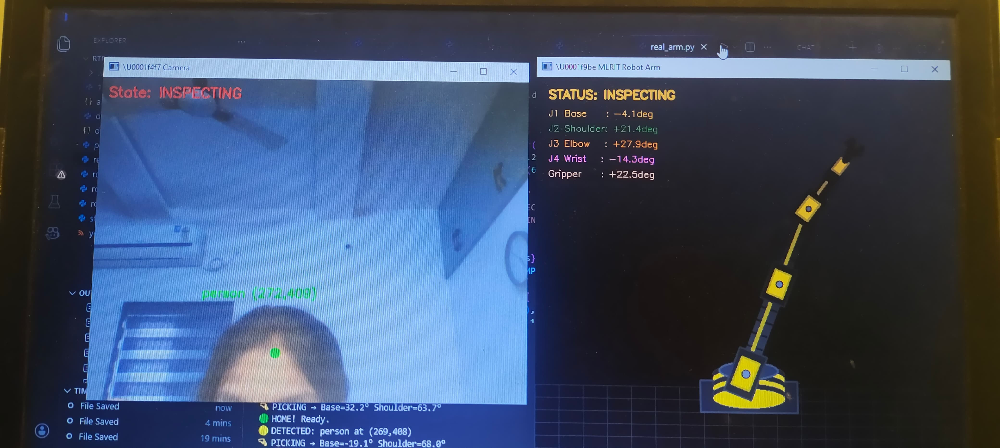
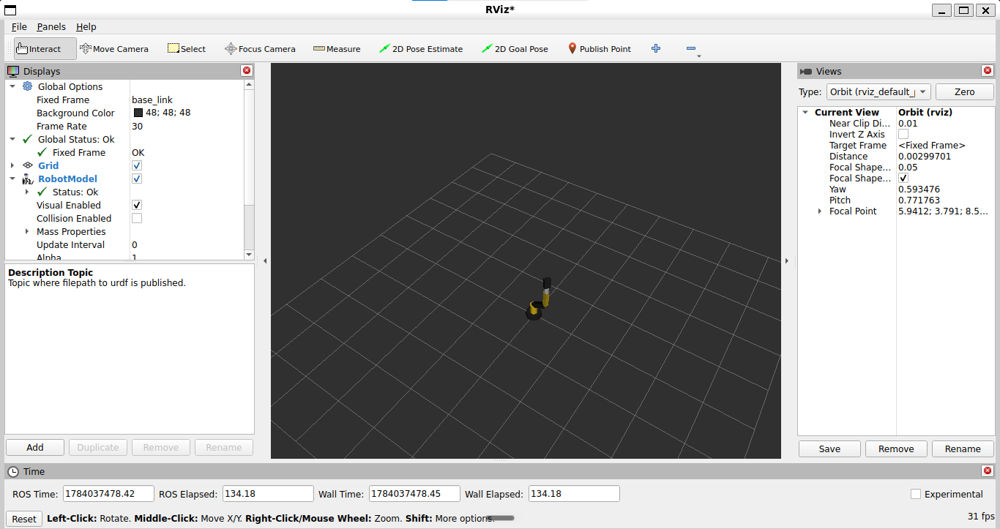
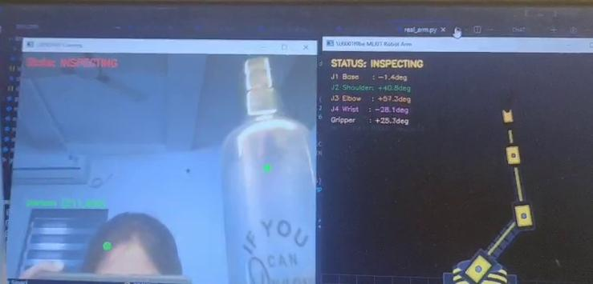
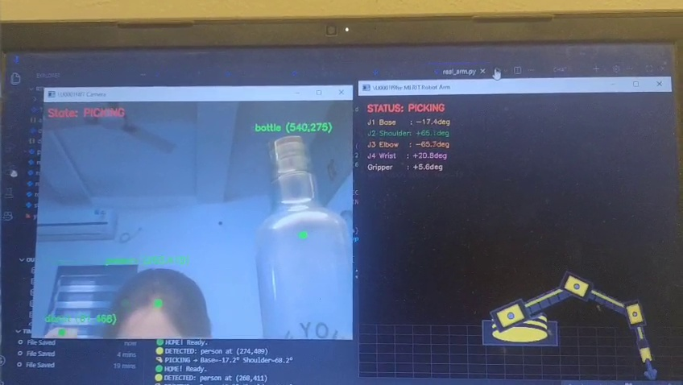
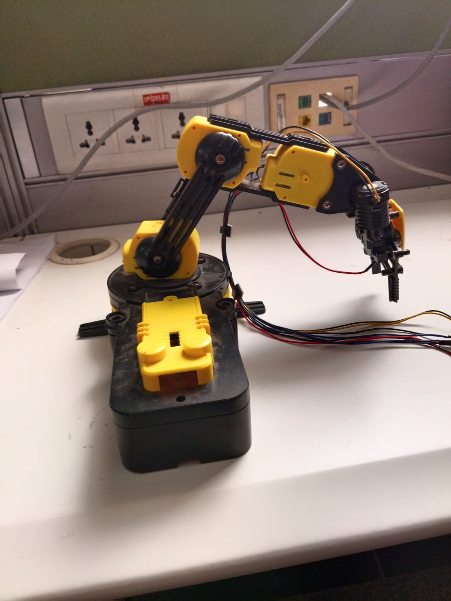
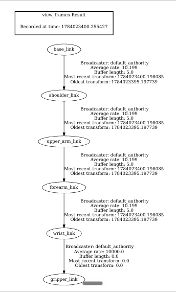

<div align="center">

# 🤖 AstraArm

### Vision-Guided Robotic Manipulation using State-Based Control in ROS 2

*A modular robotics project integrating computer vision, robot modeling, and intelligent task planning using ROS 2.*

<p>


</p>

</div>

---

# 📖 Overview

**AstraArm** is a modular robotics project built with **ROS 2 Jazzy** that demonstrates the integration of **computer vision**, **state-based task planning**, and a custom **4-DOF robotic manipulator**.

The project combines **YOLOv8** for object detection, **URDF/Xacro** for robot modeling, **TF2** for coordinate frame management, and **RViz2** for robot visualization. Each subsystem is implemented as an independent ROS 2 node, creating a clean and scalable software architecture.

Designed using a **simulation-first** approach, AstraArm provides a foundation for future extensions such as **MoveIt 2**, **Gazebo**, **inverse kinematics**, and deployment on physical robotic hardware.

---
## 📸 Project Gallery

<p align="center">



</p>

<p align="center">
<b>Vision-guided robotic manipulation workflow integrating computer vision and robotic state visualization.</b>
</p>

---

<div align="center">

| 🏠 Home State | 🔍 Inspecting State | 🎯 Picking State |
|:-------------:|:------------------:|:----------------:|
|  |  |  |

</div>

---

<div align="center">

### 🦾 Hardware Prototype



</div>

<p align="center">
The physical robotic arm prototype that inspired the software architecture and future hardware integration.
</p>

---

# ✨ Features

| Feature | Description |
|----------|-------------|
| 👁️ Vision-Based Detection | Real-time object detection using YOLOv8. |
| 🤖 Custom Robot Model | 4-DOF robotic manipulator developed using URDF/Xacro. |
| 🧠 State-Based Control | Finite State Machine (FSM) for modular task planning. |
| 📡 ROS 2 Communication | Independent ROS 2 nodes communicating through topics. |
| 🌳 TF2 Frame Management | Robot frame hierarchy generated and validated using TF2. |
| 🖥️ RViz Visualization | Interactive robot visualization and joint manipulation. |
| ⚙️ Modular Architecture | Scalable software design for future simulation and hardware integration. |

---

# 🏗️ System Architecture

AstraArm follows a modular ROS 2 architecture where perception, planning, robot description, and visualization are implemented as independent components. This separation improves maintainability, scalability, and simplifies future integration with motion planning and physical hardware.

```text
                    +----------------------+
                    |      USB Camera      |
                    +----------+-----------+
                               │
                               ▼
                    +----------------------+
                    |   YOLOv8 Vision Node |
                    |  Object Detection    |
                    +----------+-----------+
                               │
                               ▼
                    +----------------------+
                    |   Task Planner Node  |
                    |  State Machine (FSM) |
                    +----------+-----------+
                               │
                               ▼
                    +----------------------+
                    | Coordinate Transform |
                    |        TF2           |
                    +----------+-----------+
                               │
                               ▼
                    +----------------------+
                    | URDF / Xacro Robot   |
                    |     Description      |
                    +----------+-----------+
                               │
                               ▼
                    +----------------------+
                    | Robot State Publisher|
                    +----------+-----------+
                               │
                               ▼
                    +----------------------+
                    |       RViz2          |
                    | Robot Visualization  |
                    +----------------------+
```

### Core Components

| Module | Responsibility |
|--------|----------------|
| **Vision Node** | Detects objects using YOLOv8 and publishes detection data. |
| **Task Planner** | Manages robot behavior using a finite state machine. |
| **TF2** | Maintains coordinate transformations between robot links. |
| **Robot Description** | Defines the 4-DOF robot using URDF/Xacro. |
| **Robot State Publisher** | Publishes robot joint states and TF frames. |
| **RViz2** | Visualizes the robot model and allows interactive joint manipulation. |

---
# 🤖 Robot Model

AstraArm features a custom **4-DOF robotic manipulator** modeled using **URDF/Xacro**. The robot description defines the links, joints, and kinematic structure required for visualization and future motion planning.

The model is visualized in **RViz2**, while **Robot State Publisher** and **TF2** maintain the robot's joint states and frame transformations.

---

## ⚙️ Robot Specifications

| Property | Value |
|----------|-------|
| Robot Name | AstraArm |
| Degrees of Freedom | 4-DOF |
| Robot Description | URDF / Xacro |
| Visualization | RViz2 |
| Coordinate Frames | TF2 |
| Joint Control | Joint State Publisher GUI |
| ROS Distribution | ROS 2 Jazzy |

---

# 👁️ Vision Pipeline

The perception subsystem uses **YOLOv8** to detect objects from a live camera stream. Detection results are published through ROS 2 topics and consumed by the Task Planner for decision-making.

```text
Camera
   │
   ▼
YOLOv8
   │
   ▼
Object Detection
   │
   ▼
ROS 2 Topic
   │
   ▼
Task Planner
```

### Vision Capabilities

- Real-time object detection
- YOLOv8 inference
- Bounding box generation
- Object classification
- ROS 2 topic publishing
---

# 🧠 State-Based Control

AstraArm uses a **Finite State Machine (FSM)** to coordinate robot behavior. Each state has a well-defined responsibility, making the software modular and easy to extend.

```text
          START
             │
             ▼
          HOME
             │
             ▼
       INSPECTING
             │
     Object Detected?
             │
      Yes ───┴─── No
       │           │
       ▼           │
    PICKING ◄──────┘
       │
       ▼
   TASK COMPLETE
```

The state machine separates perception from control logic, allowing future integration with motion planning, inverse kinematics, and autonomous manipulation.

---

## 🔑 Key Design Principles

- Modular ROS 2 node architecture
- Simulation-first development
- Clear separation of perception and planning
- Scalable software design
- Ready for future MoveIt 2 and hardware integration

---
# 📂 Repository Structure

```text
vision-guided-robotic-manipulation-ros2
│
├── docs/                      # Documentation and generated PDFs
├── images/                    # README images
│   ├── hardware/
│   ├── hero/
│   ├── rviz/
│   ├── tf/
│   ├── vision/
│   └── workflow/
│
├── videos/                    # Project demonstrations
├── rviz/                      # RViz configuration files
│
├── src/
│   ├── astra_arm_description/ # URDF/Xacro robot description
│   └── vision_guided_robot/   # ROS 2 nodes
│
├── README.md
├── LICENSE
└── .gitignore
```

---

# ⚙️ Prerequisites

Before running AstraArm, ensure the following software is installed:

- Ubuntu 24.04
- ROS 2 Jazzy
- Python 3.12
- OpenCV
- Ultralytics YOLOv8
- RViz2
- TF2 Tools
- Colcon Build System

---

# 🚀 Installation

Clone the repository:

```bash
git clone https://github.com/mahika74/astraarm-ros2.git

cd astraarm-ros2
```

Install Python dependencies:

```bash
pip install -r requirements.txt
```

Build the ROS 2 workspace:

```bash
colcon build
```

Source the workspace:

```bash
source install/setup.bash
```

---

# ▶️ Running the Project

### Launch the Robot Model

```bash
ros2 launch astra_arm_description display.launch.py
```

This launches:

- Robot State Publisher
- Joint State Publisher GUI
- RViz2

---

### Run the Vision Node

```bash
ros2 run vision_guided_robot vision_node
```

---

### Run the Task Planner

```bash
ros2 run vision_guided_robot task_planner
```

---

### Verify the TF Tree

```bash
ros2 run tf2_tools view_frames
```

---

### Verify ROS Topics

```bash
ros2 topic list
```

---

### Verify Active Nodes

```bash
ros2 node list
```

---

# 📋 Expected Output

After launching the project you should observe:

- ✅ RViz displaying the AstraArm robot
- ✅ Interactive joint manipulation using Joint State Publisher
- ✅ TF frame hierarchy being published
- ✅ YOLOv8 object detection output
- ✅ Active ROS 2 topics and nodes
- ✅ State transitions managed by the Task Planner

---
# 📸 Results

The following screenshots demonstrate the implementation and validation of the AstraArm robotics pipeline.

<div align="center">

| 🤖 RViz Visualization | 👁️ Vision Workflow |
|:---------------------:|:------------------:|
|  |  |

| 🦾 Hardware Prototype | 🌳 TF Frame Tree |
|:---------------------:|:----------------:|
|  |  |

</div>

<p align="center">
<b>Figure 5.</b> Results demonstrating robot visualization, vision pipeline, hardware prototype, and TF frame hierarchy.
</p>

---

## 📹 Demonstration

🎥 **Project Demo**

[▶️ Watch AstraArm Demo](videos/astraarm_demo.mp4)
---

# 🎓 Learning Outcomes

This project provided practical experience in:

- ROS 2 package development
- Robot modeling with URDF/Xacro
- TF2 frame transformations
- RViz2 visualization
- YOLOv8 integration
- ROS 2 topic-based communication
- State-based robotic control
- Modular robotics software architecture
- Git and GitHub workflow

---

# 🚀 Future Roadmap

### Simulation

- Gazebo environment integration
- MoveIt 2 motion planning
- Collision checking

### Robotics

- Inverse kinematics
- Trajectory planning
- Autonomous pick-and-place

### Hardware

- Arduino-based motor control
- Real robotic arm deployment
- Camera calibration
- Closed-loop manipulation

---

# 🛠️ Tech Stack

| Category | Technologies |
|----------|--------------|
| Robotics Framework | ROS 2 Jazzy |
| Programming Language | Python |
| Computer Vision | YOLOv8, OpenCV |
| Robot Modeling | URDF, Xacro |
| Visualization | RViz2 |
| Coordinate Frames | TF2 |
| Operating System | Ubuntu 24.04 |
| Development Tools | Git, GitHub, VS Code |

---

# 👩‍💻 Author

**Mahika Bommana**

B.Tech Computer Science Engineering (AI & ML)

📧 Open to internships and collaborative robotics projects.

- GitHub: https://github.com/mahika74
- LinkedIn: https://www.linkedin.com/in/mahikabommana/

---
